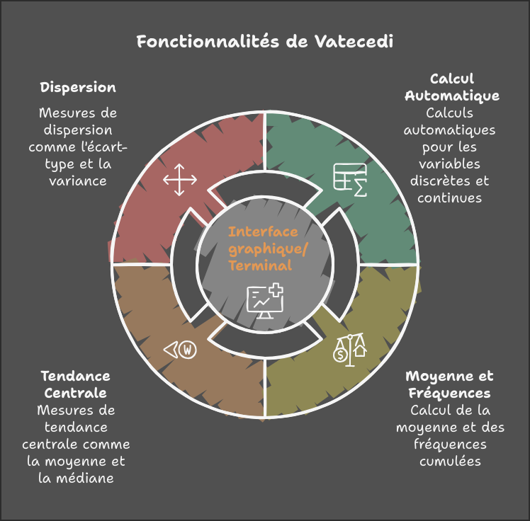
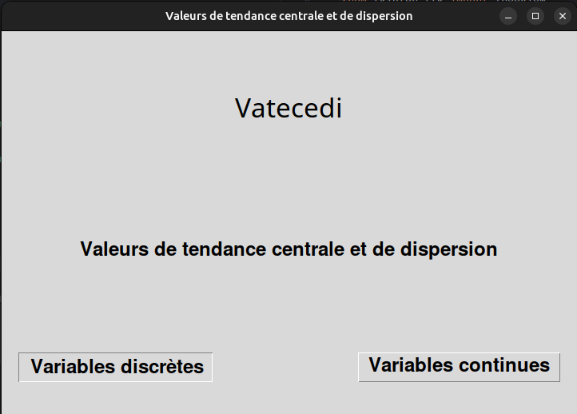
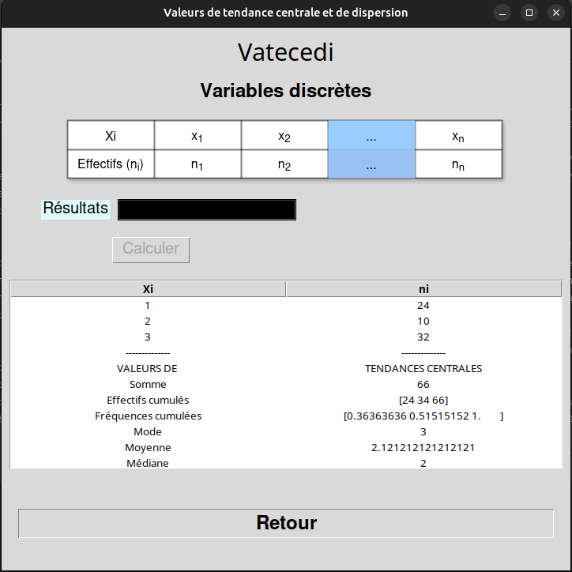

# 📊 Projet Calcul des Tendances Centrales et de Dispersion (Python)

    

## 📖 Description
Ce projet permet **d'automatiser le calcul des valeurs des effectifs d'une population** pour des variables **discrètes** ou **continues**.  
Il facilite le calcul des **mesures de tendance centrale** (moyenne, médiane, mode) et des **mesures de dispersion** (écart-type, variance, étendue, etc.).

## 🚀 Fonctionnalités



#### ✅ Calcul automatique des statistiques pour les **variables discrètes et continues**
#### ✅ Exécution en **interface graphique** ou sur le **terminal**
#### ✅ Calcul de la moyenne, effectifs et fréquences cumulées
#### ✅ Mesures de **tendance centrale** (moyenne, médiane, mode/classe modale) 
#### ✅ Mesures de **dispersion** (écart-type, variance, étendue, quartiles, coefficient de variation) 

## 🛠️ Technologies utilisées
- 🐍 **Python** - Langage principal  
- 🖼 **Tkinter** - Interface graphique
- 📏 **math** - Fonctions mathématiques intégrées
- 🧮 **NumPy** - Calculs mathématiques avancés
- 🖥 **os & sys** - Gestion des fichiers et du système

## 📦 Installation et Utilisation

### 1️⃣ Cloner le projet
```sh
git clone https://github.com/johanalain11/vatecedi.git
cd vatecedi
```

### 2️⃣ Installer les dépendances
```sh
pip install numpy
```

### 3️⃣ Lancer le script

Interface graphique
`python app.py` 

Terminal
`python main.py`

## 📂 Structure du projet

>/src
#####  ├── /images 	# Dossier des images
 	 ├── cluster.png       # Icône de l'application visible sur Windows
	 ├── Vatecedi.png	# Illustration de tableau de variables dicrètes
	 ├── Vatecedi2.png	# Illustration de tableau de variables continues
#####  ├── /modules 	# Dossier des fonctions
	 ├── varContinue.py # Fonctions concernant les variables continues
	 ├── varDiscrete.py   # Fonctions concernant les variables discrètes
######  ├── app.py          	# Interface graphique avec Tkinter
######  ├── main.py     	# Script principal
###### ├── Readme.md      	 # Documentation du projet`


## 🎨 Aperçu de l'Interface


## 📊 Exemple d'Utilisation



## Améliorations Futures
>[!NOTE]
>
>* Améliorer l'interface avec customTkinter
>* Ajouter l'interprétation des résultats et l'affichage de graphiques
>* Ajouter les fonctionnalités de chargement des données avec des fichiers CSV
>* Gérer les erreurs potentielles, comme des entrées invalides ou des dépassements de mémoire.

## Auteur
**Johan Alain**

[GitHub](https://github.com/johanalain11/)

## 📜 Licence

Ce projet est sous licence MIT.

----------

✨ **N’hésite pas à contribuer !**  
💡 **Suggestions et retours sont les bienvenus !** 😊  
📩 **Contact :** [LinkedIn](www.linkedin.com/in/johanalain11) | Email [jank092016@gmail.com](mailto:jank092016@gmail.com)


